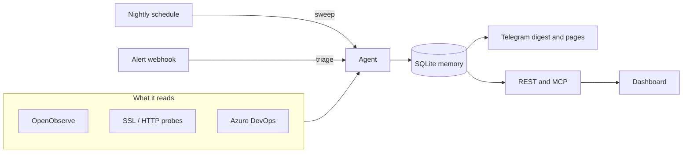

<div align="center">

<picture>
  <source media="(prefers-color-scheme: dark)" srcset="brand/mark-dark.svg">
  
</picture>

# Watchfire

**An autonomous, read-only SRE agent that watches your infrastructure
through the night and tells you what broke.**

[](https://github.com/nmehlei/watchfire/actions/workflows/build-and-push.yml)
[](LICENSE)
[](.nvmrc)
[](#it-never-writes)

[Quickstart](#quickstart) · [Usage](docs/usage.md) · [Operations](docs/operations.md) · [Deployment](docs/deployment.md) · [Specs](specs/README.md)

</div>

---

Watchfire sweeps every system you point it at once a night, investigates what looks
wrong, and sends you a digest. When an alert fires, it triages in real time and
pages you only if it is worth waking up for. It remembers what it has seen, so the
second night is quieter than the first. It runs as one small container.

## It never writes

Watchfire reads. It does not deploy, restart, scale, patch or delete — by design, and
enforced in three independent layers:

1. **Reader-scoped credentials.** Every adapter authenticates with read-only rights.
2. **A command allowlist.** The agent may run named adapter wrappers and plain read
   utilities, nothing else.
3. **A safety hook.** Mutating commands are refused before they execute.

An agent that can act on your infrastructure is a different and much riskier
product. This one cannot, and changes that would alter that are not accepted.

## How it works



Adapters produce observations; the agent turns them into findings and stores them.
Each finding is fingerprinted, so a problem seen again is recognised, escalated if
it worsened, and kept out of the way if you muted it.

## Quickstart

You need Node 24, an [Anthropic API key](docs/integrations/anthropic.md), and a
[Telegram bot](docs/integrations/telegram.md) — Watchfire delivers everything through
it and will not start without one.

```bash
git clone https://github.com/your-org/watchfire.git
cd iris
npm ci

# Your tenant registry, starting from the examples
cp apps/agent/config/tenants.example.yaml   apps/agent/config/tenants.yaml
cp apps/agent/config/resources.example.yaml apps/agent/config/resources.yaml
mkdir -p apps/agent/data

export ANTHROPIC_API_KEY=…
export TELEGRAM_BOT_TOKEN=…
export TELEGRAM_CHAT_ID=…
# Paths are relative to apps/agent; the defaults point at /etc and /var.
export IRIS_TENANTS_PATH=config/tenants.yaml
export IRIS_RESOURCES_PATH=config/resources.yaml
export IRIS_DB_PATH=data/iris.db

npm run dev
```

Watchfire listens on port 8080 — `curl localhost:8080/health` should answer
`{"ok":true}`. Set `IRIS_API_TOKEN` as well to enable the REST API and MCP endpoint.

The [usage guide](docs/usage.md) covers configuring real tenants, credentials for
each system, and what to expect from the first run.

## Repository layout

| Path | What |
|---|---|
| [`apps/agent/`](apps/agent/) | The agent: adapters, runner, memory, API |
| [`apps/dashboard/`](apps/dashboard/) | Next.js dashboard over the REST API |
| [`specs/`](specs/README.md) | The specification — behaviour changes start here |
| [`docs/`](docs/) | Usage, operations, deployment, integrations |
| [`infra/ssh/`](infra/ssh/) | Constrained forced-command shell for monitored hosts |
| [`brand/`](brand/) | Logo sources |

## Documentation

- [Usage](docs/usage.md) — configure it and run it
- [Operations](docs/operations.md) — inspect it, rotate credentials, debug a bad night
- [Deployment](docs/deployment.md) — the container, the dashboard, and their layouts
- [Integrations](docs/integrations/README.md) — setting up each system Watchfire reads
- [Specifications](specs/README.md) — how it behaves, and what is built versus planned
- [Contributing](CONTRIBUTING.md) · [Security](SECURITY.md)

## Licence

[AGPL-3.0-only](LICENSE). If you run a modified Watchfire as a network service, you must
offer its source to your users. The licence file also carries a narrow Section 7
permission covering the proprietary Claude Agent SDK that Watchfire depends on.

Container images are not published — build from source. See
[deployment](docs/deployment.md#what-is-not-published) for why.

> Watchfire is not affiliated with InterSystems Watchfire®.
